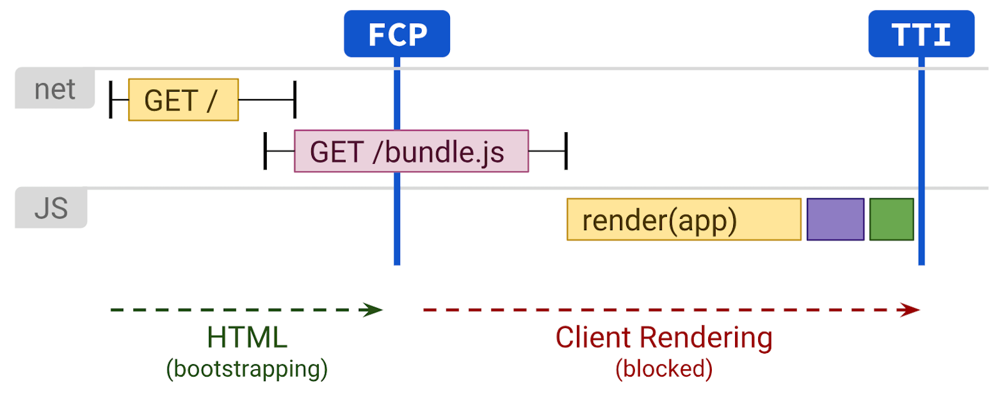
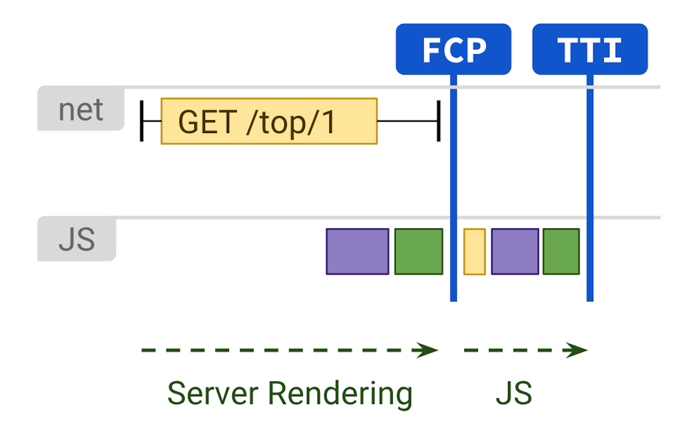
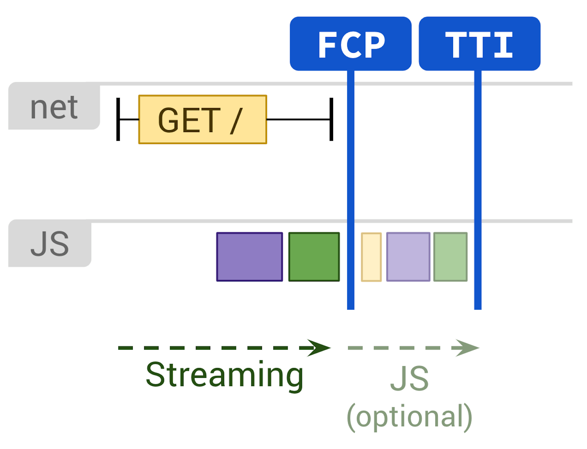
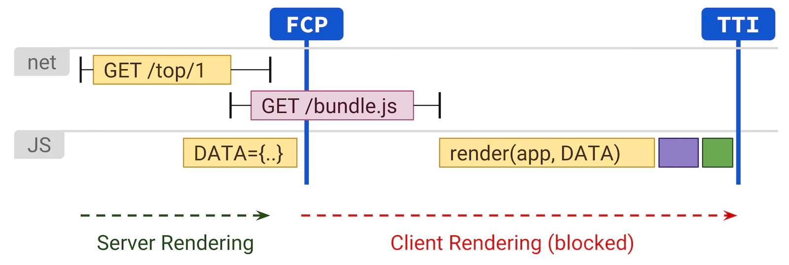

## 前端渲染方案

前端的渲染方案主要有:

-   CSR: 客户端渲染 (Client Side Rendering)，也叫(Browser Side Render)，即现在 Vue/React 的 SPA 架构的方式。
-   SSR： 服务端渲染(Server Side Rendering)，服务端渲染好 HTML 模板，交由浏览器渲染。
-   SSG：页面静态化 Static Side Generation，把页面提前渲染成 HTML。

### CSR

Client Side Rendering 是指直接在浏览器中使用 JavaScript 渲染页面。所有的逻辑、数据请求、模板和路由都由浏览器而不是服务器去处理。

重要的 script 和数据可以使用 `<link rel=preload>` 来更早地被请求，这样可以让解析器(parser)更早地执行这段 script。

> 见: https://developer.mozilla.org/en-US/docs/Web/HTML/Link_types/preload

缺点:

-   白屏时间长。
-   SEO 不友好
-   ...

### SSR

SSR 是指服务端渲染好整份 HTML，然后将该 HTML 作为导航的响应交给浏览器渲染。这避免了额外的往返时间损耗（数据请求、模板请求等）。

优点:

-   更快的 First Paint 和 First Contentful Paint(FCP)。
-   避免发送大量的 JS 代码，可以让渲染有更快的 Time to Interactive(TTI)。
-   可以开启**流式渲染**，进一步加快页面渲染速度

缺点:

-   在服务端生成页面需要花时间，这可能会导致更慢的 TTFB(Time to First Byte)。

Server Side Rendering 不是一个银弹。它的动态性会带来非常大的计算量。正确地使用 SSR 涉及到 component caching、memory consumption 和 memorization 等技巧

### SSG

Static Side Generation 发生在构建时间，它可以提供一个非常快的 First Paint,First Contentful Paint 和 Time to Interative（假设客户端的 JS 是有限的）。

这里和 SSR 不同的是，这里的 Time to First Byte 也是非常快的，因为它不需要渲染 HTML，HTML 在构建时就已经确定了。 一般来说，SSG 会为每一个 url 都提前生成 HTML，因此这些静态资源可以部署到多个 CND 上，从而进行 edge-caching。

### 通过 rehydration 结合 SSR 和 CSR

Server 端将 application 渲染成 HTML，然后将用于渲染的 JavaScript 和数据都内嵌在 HTML 中，返回给浏览器渲染，挂载对应的 DOM 事件等等，这个过程也叫做 [hydration](https://vite-plugin-ssr.com/hydration)。

这样做可以让 FCP 和 SSR 一样快，但是还需要在客户端渲染，但是 Time to Interactive 还是比较慢，因为它需要等 JS 执行挂载任务后才能对用户进行响应。

### Progressive Hydration

The time that the user sees non-interactive UI on the screen is also refered to as the **uncanny valley**: although users may think that they can interact with the website, there are no handlers attached to the components yet. This can be a frustrating experience for the user, as the UI may look like it's frozen!

从服务端发送来的 DOM 组件被完全 hydrated 需要花一定的时间。在组件完全被 hydrated 之前，JS 文件可以被加载、处理和执行，而不是一次性 hydrate 整个 application，即我们可以渐进式 hydrate 这些 DOM 结点。

<video controls width="100%" src="https://res.cloudinary.com/ddxwdqwkr/video/upload/v1609056522/patterns.dev/prog-rehy-2.mp4">
</video>

通过这样，我们可以减少让页面具有响应的JS数量，同时可以只hydrate用户需要的结点。

<video controls width="100%" src="https://res.cloudinary.com/ddxwdqwkr/video/upload/v1609056521/patterns.dev/prog-rehy-5.mp4">

Progressive hydrate可以让我们只hydrate特定条件的组件，比如只hydrate视口内可见的组件。

progressive hydration 有可能在特定条件下让组件无法响应，但是这个基本上对用户来说无感。